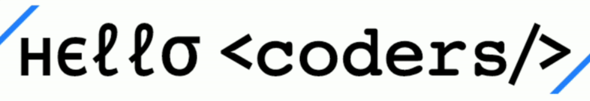

<!--img src="./sunrise_clickedbyme.jpeg?raw=true" width="1000px"-->

  
  
  
#### 3 year Coders 
#### Life Code Music Basketball Game.
### Vibing to : 🎧  <!--img src="https://media.giphy.com/media/kC8QA2OYWOADK0e1Uk/giphy.gif" width="30" style="padding-top: 10px;" -->

<!--img alt="Spotify" src="https://spotify-readme.z-jie-web.vercel.app/api/spotify" href="https://open.spotify.com/user/somnathpaul" &count_private=true&bg_color=904e99&title_color=fff&text_color=fff&icon_color=f2f2f2-->

<!--https://media2.giphy.com/media/M9kgjEsLG6LMbYC9dl/giphy.gif -->
<!-- 

   -->

-   &nbsp; I’m currently learning **NODE, Flutter & VUE**.  
- &nbsp;&nbsp;&nbsp; I like exploring **REACT**.  
- &nbsp;&nbsp; Ask me about **Pc building, Movies, or anything**.  
-  &nbsp; I'll tell you **I don't even know** 
- &nbsp;&nbsp;&nbsp;&nbsp;&nbsp;&nbsp;Fun fact: Banging your head against a wall for one hour burns **150 calories**. 

  

